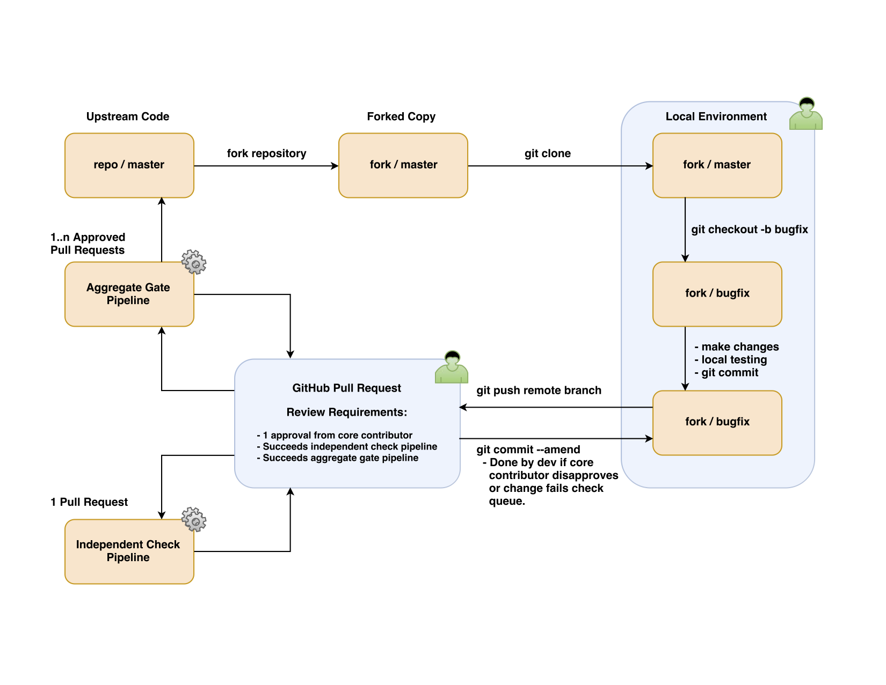

# Use

## Table of Contents

* [Automated Testing](#automated-testing)
* [Pull Request Lifecycle](#pull-request-lifecycle)
* [BonnyCI Workflow](#bonnyci-workflow)

## Automated Testing

When a developer opens a pull request against a project, that pull request moves into the "check" queue. This functions similarly to other continuous integration solutions such as [Travis CI](https://travis-ci.com/) and [Jenkins](https://jenkins.io/). The check queue applies the code in the pull request to the existing codebase and tests it independently. This functionality is not new to GitHub users, but needed as a part of a full continuous integration solution.

If a pull request fails the check queue, then it will not be able to move on to further testing. The developer will make changes to the pull request until it passes the check queue. Concurrently, core contributors of the project will be reviewing pull requests. Core contributors confirm pull requests' technical value and guideline conformity.

Now we have a pull request that has core contributor approval and successful check queue results. That pull request will automatically move on to the "gate" queue. The gate queue collects all pull requests in this state and tests them together in their theoretical merge order. If any pull request in the gate queue fails, BonnyCI reports it on the pull request's conversation page. The pull requests that remain in the gate queue are re-tested together in their new theoretical merge order. This process repeats until no failures are present. Any pull requests which pass the gate queue are automatically merged. This ensures that what gets tested is what gets merged, and is new functionality to GitHub users.

## Pull Request Lifecycle

1. New pull request is opened against your repository.
2. BonnyCI places pull request on top of existing repository codebase and tested independent of any other open pull requests (the `github_check` zuul pipeline).
3. Contributors to the project review the pull request. If changes are requested, the pull request author will make them and amend the commit.
4. A Core contriubtor gives an `approved` review.
5. BonnyCI places all open pull requests with `approved` reviews on top of the existing repository codebase in the order they were approved (the `github_gate` zuul pipeline). If any pull request fails the testing, BonnyCI will kick that pull request out and test the remaining changes together. This testing process will recurse until the build passes.
6. Once the pull request passes both rounds of testing, BonnyCI will automatically merge the pull request to the repository's master branch.

## BonnyCI Workflow

This image illustrates the BonnyCI continuous integration pipeline.

